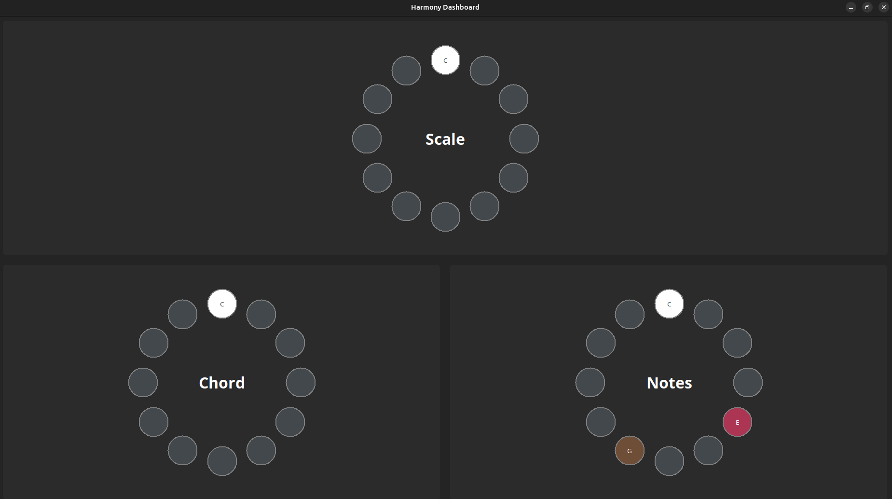
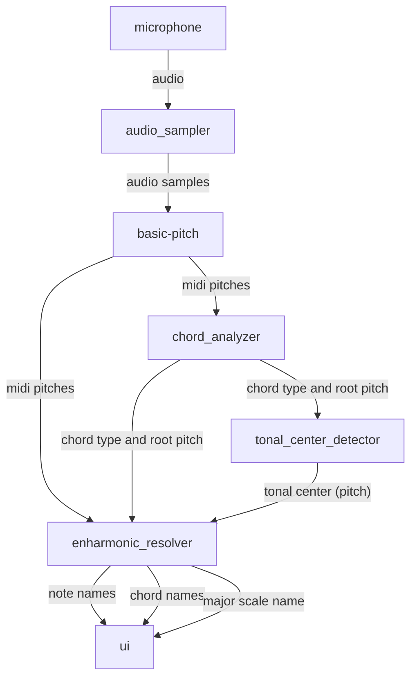

# Harmony Dashboard
This app performs real-time musical harmony analysis on audio streamed from the device's default microphone.  It is a work-in-progress.


## Prerequisites
You will need:  **Python 3.11** (lower minor versions of python 3 should work, but have not been tested and may have different pip dependencies)

Depending on your system, you may also need to install:
- python3.11-venv
- python3.11-tk
- python3.11-dev
- portaudio19-dev

## Instructions to Run

### Linux
```
cd /path/to/this/directory
./run_harmony_dashboard.bash
```

### Windows

#### One Time Setup:

```
cd \path\to\this\directory
python3.11 -m venv venv
.\venv\Scripts\activate.bat
pip install -r requirements.txt
```
#### After One Time Setup:

```
cd \path\to\this\directory
.\venv\Scripts\activate.bat
python -m harmony_dashboard
```

## Capabilities

### Real-Time Note Detection
This app leverages Spotify's AI-powered `basic-pitch` library to detect notes, including multiple simultaneous notes (polyphony)

### Real-Time Chord Recognition
A matching algorithm detects chords based on notes detected by `basic-pitch`.  The algorithm can detect chords as they naturally occur in classical music.  In particular, it is robust to:
- Any inversion
- Any form (e.g. solid chords, arpeggios, 4 part arrangements, etc.)
- Missing and extraneous notes, within reason

The following chord types are currently supported:
- Major
- 7th
- Major 7th
- Minor
- Minor 7th
- Diminished
- Diminished 7th

### Real-Time Tonal-Center Recognition
The algorithm uses the chords that it recognizes to deduce the most likely tonal center (major scale) of the music.  It can dynamically detect key changes with some amount of latency (~5 chord changes).

### Enharmonic Resolution
Using the detected tonal-center and chords discovered, the algorithm applies the correct key signature and/or accidentals to the notes, chords, and scales detected.  For example, it will report a note as "G sharp" if it is part of an E Major chord, but will report the same note as "A flat" if it is part of an F minor chord.

### Test Conditions
This app has been effective when tested under the following conditions:
| Factor | Conditions|
| ------ | --------- |
| Musical Instrument(s)| Upright and electronic pianos, in varying ranges of in-tune-ness |
| Musical Genre(s)| Classical,  pop|
| Sound Device | mid-range mic (e.g. blue snowball)|
| OS | Ubuntu 24.04 |
| Processor | Intel Core Ultra 9|
| GPU | No GPU acceleration used|

## Algorithm

### Data Flow
At a high level, the app samples audio from a stream at a certain frequency.  For each sample, the following occurs:
1. Since `basic-pitch` does not have a real-time api, we must sample audio and feed it to `basic-pitch` in small chunks.
2. `basic-pitch` detects midi-pitches.
3. The Chord Analyzer uses a matching algorithm to infer the chord-type and the root note of the chord (as a midi pitch) based on those pitches.
4. The Tonal Center Detector keeps a sliding window of chords over time, then applies a convolutional filter over that window of chords to guess the pitch of the tonal center (similar to object detection, but in pitch space rather than pixel space).
5. The Enharmonic Resolver selects the major scale for the tonal center with the least sharps and flats
6. The Enharmonic Resolver then attempts to assign the most appropriate chord name for the current chord such that it fits within the current major scale.  In the event of key modulation, it will select the enharmonic equivalent for the chord that will result in minimal movement on the circle of fifths.
7. Finally, the Enharmonic Resolver applies the key signature to the individual notes detected.  For notes that do not fit within the current scale, it will attempt to assign the most appropriate note names based on the current chord.  (e.g. "A flat" does not appear in the key of C major, but if it is detected as part of an "F minor" chord, the Enharmonic Resolver will know to refer to it as "A flat" rather than "G sharp")
8. The results are displayed on the GUI


### Chord & Scale Detection (Convolutional Filters)
The chord and scale detection algorithms in this project are based on a novel application of convolutional filters in pitch and chord space (novel as far as I am aware).

The following convolutional filters used here for chord and scale detection are a first attempt based on my personal musical training and intuition.  In the future, they can be manually tuned and/or trained as part of a machine learning model.

#### Chord Detection
In music theory, pitch ascends in a repeating pattern with a period of 12 semitones called an octave (think a spiral). For our purposes, position of the pitch within the octave matters more than the octave itself, so we can flatten the z axis and model pitch as a circle.

Every pitch detected in a sample can be marked as `1` on this circle (and pitches not detected left as `0`).  When flattened, it forms the following input vector:

A|A#|B|C|C#|D|D#|E|F|F#|G|G#|
|--|--|--|--|--|--|--|--|--|--|--|--|
|...|...|...|...|...|...|...|...|...|...|...|...|

Each type of chord (e.g. major, minor, diminished) can be represented as a rotation-invariant pattern of intervals laid out on this circle.  For example, a major triad is a note at any arbitrary pitch followed by a second note 4 semitones above it, then a third note 3 semitones above that.  This pattern forms the "kernel" for the major chord that can be convolved around the circular octave.  The following matrix represents a the kernels for various chord types stacked vertically.  The x-axis represents semitones above the chord root, and the y axis represents the chord type:


||0|1|2|3|4|5|6|7|8|9|10|11|
|--|--|--|--|--|--|--|--|--|--|--|--|--|
|maj|3|0|0|0|1|0|0|2|0|0|0|0|
|7|3|0|0|0|1|0|0|2|0|0|1|0|
|maj 7|3|0|0|0|1|0|0|2|0|0|1|0|
|min|3|0|0|1|0|0|0|2|0|0|0|0|
|min7|3|0|0|1|0|0|0|2|0|0|1|0|
|dim|3|0|0|1|0|0|2|0|0|0|0|0|
|dim7|3|0|0|1|0|0|2|0|0|1|0|0

Convolving this over our input in 2 dimensions gives us the following output matrix where the row and column of cell  with the highest value indicate the predicted chord type and root note, respectively:

||A|A#|B|C|C#|D|D#|E|F|F#|G|G#|
|--|--|--|--|--|--|--|--|--|--|--|--|--|
|maj|..|..|..|..|..|..|..|..|..|..|..|..|
|7|..|..|..|..|..|..|..|..|..|..|..|..|
|maj 7|..|..|..|..|..|..|..|..|..|..|..|..|
|min|..|..|..|..|..|..|..|..|..|..|..|..|
|min7|..|..|..|..|..|..|..|..|..|..|..|..|
|dim|..|..|..|..|..|..|..|..|..|..|..|..|
|dim7|..|..|..|..|..|..|..|..|..|..|..|..|

#### Tonal Center Detection
After identifying a few chords, we can begin tallying the number of chords detected recently in the following table:
||A|A#|B|C|C#|D|D#|E|F|F#|G|G#|
|--|--|--|--|--|--|--|--|--|--|--|--|--|
|maj|..|..|..|..|..|..|..|..|..|..|..|..|
|7|..|..|..|..|..|..|..|..|..|..|..|..|
|maj 7|..|..|..|..|..|..|..|..|..|..|..|..|
|min|..|..|..|..|..|..|..|..|..|..|..|..|
|dim|..|..|..|..|..|..|..|..|..|..|..|..|

This table forms the input for tonal center detection. Each tonal center has a group of "correct chords".  For example, the pitch at the tonal center (tonic) should form the root note of a major chord.  The pitch one semitone above the tonal center should not be used, and the pitch two semitones above the tonal center (suptertonic) should form a minor chord etc etc.  This pattern of "correct" chords can be represented as a kernel where the x axis is the number of pitches above the tonal center, and the y axis is the chord type:

||0|1|2|3|4|5|6|7|8|9|10|11|
|--|--|--|--|--|--|--|--|--|--|--|--|--|
|maj|1|0|0|0|1|1|0|1|0|0|0|0|
|7|0|0|0|0|1|0|0|1|0|0|0|0|
|maj 7|1|0|0|0|0|1|0|0|0|0|0|0|
|min|0|0|1|0|1|0|0|0|0|1|0|0|
|dim|0|0|1|0|0|1|0|0|1|0|0|1|


Convolving this kernel over our input matrix from left to right gives us a 1D output vector where the column of the highest value indicates the most likely tonal center:

|A|A#|B|C|C#|D|D#|E|F|F#|G|G#|
|--|--|--|--|--|--|--|--|--|--|--|--|
|..|..|..|..|..|..|..|..|..|..|..|..|